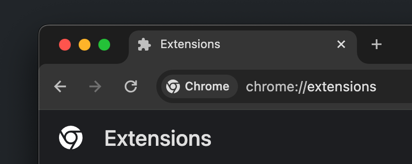
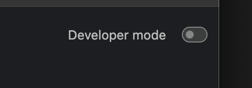
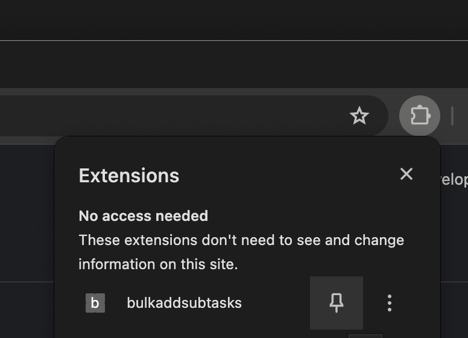

# bulkAddSubtasks

A not so smart chrome extension to bulk add subtasks to the currently viewed Jira issue.

# motivation

Creating a lot of Sub-Tasks can be tedious with all the back and forth between selecting the input field and klicking the crate button. So why not create them all at once?
This extension adds an extra input field to throw in all your desired sub-tasks, seperated by ; and create them with one click.

# usage

1. Access Extension Management Page: Type `chrome://extensions/` in the address bar and press Enter.
   

2. Enable Developer Mode: In the top right corner of the Extensions page, you’ll see a switch for Developer mode. Turn it on. This allows you to load unpacked extensions.
   

3. Load the Unpacked Extension: Click on the load unpacked button which will appear in the corner after you enable Developer Mode. A file dialog will open. Navigate to your clone of the repo and click open.
   

4. pin the extension to the toolbar
   

5. On a\* page showing a detail view of the issue you want to add the subtasks to, klick on the extension icon. A div with an input field and a button will appear. Insert all the subtask summaries you want to add, seperated by ;
   Klick the button and the upload will trigger. The page will refresh and your new subtasks should be visible. Ocassionally the new Sub-Tasks are not present in the refresh because the server is too slow. In that case you have to manually refresh, or just move to the next issue. If the refresh was triggered, the Sub-Tasks have been created.

# auth

Auth is handled by your session. The JIRA API relies on browser-based authentication (like cookies or session tokens) for requests originating from the same domain. When the extension's script makes a fetch request to the JIRA API from a page on the same domain, it automatically includes these credentials, thanks to the browser's same-origin policy.

# To do

- fix page refresh not fetching (all) new sub-tasks
- adjust container styling based on rendered page
- trigger on page load instead of button click (20 Storypoints ez)
- add extension configuration to manually add target URL instead of relying on manifest.json matcher
